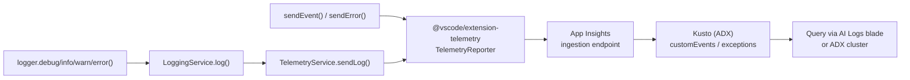

# Telemetry Plan — Logic Apps Migration Agent

This document captures the analysis and implementation behind flowing the extension's
logs and usage telemetry to **Azure Data Explorer (Kusto)** via **Application Insights**.

- **Status:** Implemented (pending CI key configuration / first release build)
- **Goal:** All extension logs (`debug`/`info`/`warn`/`error`) and usage events reach Kusto so they can be queried for diagnostics and adoption metrics.
- **Reference extension:** `microsoft/LogicAppsUX` (`apps/vs-code-designer`), which already ships telemetry to the same backend.

---

## 1. Objective

Enable end-to-end telemetry so that:

1. **Error-level** logs written through `LoggingService` are forwarded to Application Insights (lower-severity logs stay local in the output channel).
2. Existing usage/error events (`sendEvent`, `sendError`) continue to flow.
3. Data lands in Kusto, queryable via the Application Insights Logs blade.
4. User privacy settings (VS Code global telemetry + an extension toggle) are respected.
5. Sensitive data (absolute file paths, user home directories) is **redacted** before any log leaves the machine.
6. The Application Insights connection string is **injected at build time**, never committed in plaintext source.

---

## 2. How logs reach Kusto (the model)

There is **no direct extension → Kusto path**. Kusto is the storage backend of
Application Insights. The extension talks to the Application Insights ingestion
endpoint using `@vscode/extension-telemetry`; Microsoft manages the
Application Insights → Kusto bridge at the platform level.



---

## 3. Reference extension analysis (LogicAppsUX)

Findings from `microsoft/LogicAppsUX` that informed the approach:

| Aspect                   | Detail                                                                                                             |
| ------------------------ | ------------------------------------------------------------------------------------------------------------------ |
| Telemetry library        | `@vscode/extension-telemetry` (`^0.9.8`)                                                                           |
| Init location            | `apps/vs-code-designer/src/main.ts` — `new TelemetryReporter(telemetryString)`                                     |
| Placeholder              | `const telemetryString = 'setInGitHubBuild';` (line ~47)                                                           |
| Key injection            | `sed -i 's/setInGitHubBuild/${{ env.AI_KEY }}/g' apps/vs-code-designer/src/main.ts` during the production build    |
| Connection string        | _Injected at build time from a CI secret — never stored in source._                                                |
| Connection string source | `AI_KEY` / `NX_AI_CON_STR` secret in `.github/workflows/production-build.yml`                                      |
| Event framework          | `@microsoft/vscode-azext-utils` via `callWithTelemetryAndErrorHandling` (`IActionContext` properties/measurements) |
| Backend                  | Application Insights, backed by Kusto (Azure Data Explorer)                                                        |

**Key takeaway:** the secret is never stored in source — it is a placeholder string
replaced from a CI variable at build time. We reuse the same Application Insights
resource and the same injection pattern.

---

## 4. Current-state analysis (gaps found)

Before this work, telemetry existed but was inert. Gaps identified:

| #   | Gap                                                                                                                      | Location                                   | Impact                                                      |
| --- | ------------------------------------------------------------------------------------------------------------------------ | ------------------------------------------ | ----------------------------------------------------------- |
| 1   | `connectionString = ''` — reporter never created                                                                         | `src/services/TelemetryService.ts`         | Nothing was ever sent                                       |
| 2   | Logs not forwarded — `log()` only called `outputChannel.appendLine()`                                                    | `src/services/LoggingService.ts`           | `logger.*` calls never reached telemetry                    |
| 3   | Config namespace bug — services read `getConfiguration('logicAppsMigration')` but settings use `logicAppsMigrationAgent` | both services                              | `enableTelemetry` / `logLevel` always fell back to defaults |
| 4   | Settings not registered — only `deploymentModel` and `azure.*` existed                                                   | `package.json` `contributes.configuration` | No user-facing telemetry / log-level controls               |
| 5   | No build-time key injection — no `define`, no `aiKey`, no pipeline step                                                  | `esbuild.js`, CI pipelines                 | No way to populate the connection string for a release      |

---

## 5. Implementation

### 5.1 `TelemetryService` (`src/services/TelemetryService.ts`)

- Replaced the empty value with a build-time placeholder held in a `telemetryKey`
  field (the same `setInGitHubBuild` marker LogicAppsUX uses):
    ```ts
    private readonly telemetryKey: string = 'setInGitHubBuild';
    ```
- The reporter is created **only** when telemetry is enabled **and** the placeholder
  was replaced at build time (or a local override was supplied). A `PLACEHOLDER`
  constant, assembled from fragments so the build's find/replace does not rewrite it,
  is used to detect replacement:
    ```ts
    private static readonly PLACEHOLDER = 'setIn' + 'GitHub' + 'Build';
    // ...
    const telemetryKey = this.resolveTelemetryKey();
    if (this.isEnabled && telemetryKey) {
        this.reporter = new TelemetryReporter(telemetryKey);
    }
    ```
    `TelemetryReporter` accepts a **bare instrumentation key** (what the CI build
    injects) or a full connection string; we standardize on the bare key. For local F5
    testing, `resolveTelemetryKey()` falls back to the `LOGICAPPS_MIGRATION_AI_KEY`
    environment variable (a bare key, via `.env.local`).
- Added `sendLog(level, message, metadata)` which emits a `log` event to
  Application Insights. It swallows errors and **never** calls back into
  `LoggingService`, preventing a logging ↔ telemetry recursion loop.
- Existing `sendEvent()` and `sendError()` are unchanged.

### 5.2 `LoggingService` (`src/services/LoggingService.ts`)

- `log()` forwards **only error-level** entries to `TelemetryService.sendLog()`, in
  addition to writing to the output channel. Debug/info/warn logs stay local.
- A `forwardingToTelemetry` re-entrancy guard ensures telemetry-internal logging
  cannot recurse:
    ```ts
    if (level === LogLevel.Error && !this.forwardingToTelemetry) {
        this.forwardingToTelemetry = true;
        try {
            TelemetryService.getInstance().sendLog(levelNames[level], message, metadata);
        } finally {
            this.forwardingToTelemetry = false;
        }
    }
    ```

### 5.3 Config namespace fix

Both services now read `getConfiguration('logicAppsMigrationAgent')`, matching the
registered settings and the existing change-listeners.

### 5.4 Settings registration (`package.json`)

```jsonc
"logicAppsMigrationAgent.enableTelemetry": {
    "type": "boolean",
    "default": true,
    "description": "Send anonymous usage and diagnostic logs to Application Insights (stored in Kusto). Also respects the global telemetry.telemetryLevel setting."
},
"logicAppsMigrationAgent.logLevel": {
    "type": "string",
    "enum": ["debug", "info", "warn", "error"],
    "default": "info",
    "description": "Minimum severity for logs written to the output channel and forwarded to telemetry."
}
```

---

## 6. Build-time key injection

This mirrors the LogicAppsUX mechanism. The Application Insights
**instrumentation key** is stored as a CI variable named `AI_KEY` and injected at
build time into two places: the `aiKey` field in `package.json` and the
`setInGitHubBuild` placeholder in `src/services/TelemetryService.ts`. Source only ever
contains the literal `setInGitHubBuild`; the key arrives at build time. **No key is
committed to the repository.**

- **GitHub release build** (unsigned VSIX on the GitHub release page): injects from
  `env.AI_KEY` (sourced from `vars.AI_KEY`) via `jq` + `sed`.
- **Azure DevOps 1ES build** (the signed Marketplace VSIX): injects from `$(AI_KEY)`
  unconditionally (injects whatever the variable holds, like LogicAppsUX).

### 6.1 GitHub release workflow (Ubuntu / `jq` + `sed`)

`.github/workflows/version-release.yml` — workflow-level `env:` plus steps before "Build VSIX":

```yaml
env:
    AI_KEY: ${{ vars.AI_KEY }}

# ...
- name: 'Set VSIX aiKey in package.json'
  run: |
      jq --arg key "${{ env.AI_KEY }}" '.aiKey = $key' package.json > package.tmp.json
      mv package.tmp.json package.json

- name: 'Replace placeholder with telemetry key'
  run: sed -i "s/setInGitHubBuild/${{ env.AI_KEY }}/g" src/services/TelemetryService.ts
```

### 6.2 Official 1ES build (Windows / PowerShell)

`.azure-pipelines/templates/build.yml` — step added before lint/build. This is the
**official signed Marketplace build** (`1esmain.yml` → templates). It injects the key
into both `package.json` and the source, unconditionally (LogicAppsUX style):

```yaml
- powershell: |
      $aiKey = $env:AI_KEY
      $pkg = Join-Path '$(working_directory)' 'package.json'
      (Get-Content $pkg -Raw).Replace('setInGitHubBuild', $aiKey) | Set-Content $pkg -NoNewline
      $src = Join-Path '$(working_directory)' 'src/services/TelemetryService.ts'
      (Get-Content $src -Raw).Replace('setInGitHubBuild', $aiKey) | Set-Content $src -NoNewline
  displayName: 'Inject Application Insights key'
  env:
      AI_KEY: $(AI_KEY)
```

> The placeholder survives esbuild minification (verified), so the injection
> reaches the shipped `dist/extension.js`.

---

## 7. Privacy & opt-out

Telemetry is suppressed when **any** of the following hold:

- `logicAppsMigrationAgent.enableTelemetry` is `false`.
- VS Code global `telemetry.telemetryLevel` is `off`.
- The build was not key-injected (the placeholder lacks `InstrumentationKey=`), e.g. local/dev builds.

Log volume is intrinsically low because **only error-level logs** are forwarded
(debug/info/warn never leave the output channel). Before sending, `sendLog()`
**redacts** absolute file paths / user home directories (keeping only the file
name, plus `:line:col` for stack frames) and **caps** each property at 2048 chars.

---

## 8. Event schema

| Event name | Source                                                             | Key properties                                                                                                                      |
| ---------- | ------------------------------------------------------------------ | ----------------------------------------------------------------------------------------------------------------------------------- |
| `log`      | `LoggingService` → `sendLog()` (error-level only)                  | `level` (always `ERROR`), `message` (redacted), plus any `metadata` keys (redacted, e.g. `errorName`, `errorMessage`, `errorStack`) |
| `error`    | `sendError()`                                                      | `errorName`, `errorMessage`, plus caller properties                                                                                 |
| `<custom>` | `sendEvent()` call sites (e.g. `command.executed`, `tool.invoked`) | event-specific properties / measurements                                                                                            |

All land in the Application Insights `customEvents` table (and `exceptions` for errors).

---

## 9. Verification performed

- `tsc` (compile), `eslint` (lint), and the production esbuild bundle all pass for the changed files.
- Confirmed the `setInGitHubBuild` placeholder survives the minified `dist/extension.js`.
- Simulated the injection → ran the production build (exit `0`) → confirmed the real
  key is present in `dist/extension.js` and the placeholder is gone →
  restored the placeholder source and rebuilt a clean local bundle.

> Note: a pre-existing, unrelated `tsc` error exists
> (`src/views/discovery/SourceFlowVisualizer.ts` — `getMigrationBannerCss` unused, TS6133).
> It is not part of this change and does not block CI, which builds via esbuild, not `tsc`.

---

## 10. Verify in Kusto

After a release build, query the Application Insights resource:

```kusto
customEvents
| where name == "log"
| project timestamp,
          level   = tostring(customDimensions.level),
          message = tostring(customDimensions.message)
| order by timestamp desc
```

Usage events and errors:

```kusto
customEvents
| where name in ("command.executed", "command.completed", "tool.invoked")
| summarize count() by name, bin(timestamp, 1h)
```

```kusto
exceptions
| project timestamp, problemId, outerMessage, customDimensions
| order by timestamp desc
```

---

## 11. Files changed

| File                                    | Change                                                                                                                           |
| --------------------------------------- | -------------------------------------------------------------------------------------------------------------------------------- |
| `src/services/TelemetryService.ts`      | `setInGitHubBuild` placeholder + bare-key detection, guarded reporter init, `sendLog()` with redaction + size cap, namespace fix |
| `src/services/LoggingService.ts`        | Forward error-level logs only to telemetry, with re-entrancy guard, namespace fix                                                |
| `package.json`                          | Added `aiKey` manifest placeholder; registered `enableTelemetry` and `logLevel` settings                                         |
| `.github/workflows/version-release.yml` | Workflow `env:` (`AI_KEY`); `jq` + `sed` injection from `env.AI_KEY` (Ubuntu)                                                    |
| `.azure-pipelines/templates/build.yml`  | Unconditional key injection into `package.json` + source (Windows / official signed build)                                       |

---

## 12. Follow-ups / open items

- **CI key (required for telemetry):** set `AI_KEY` (the bare App Insights instrumentation
  key) as a GitHub Actions **variable** and an Azure DevOps **variable**. Both builds inject
  whatever the variable holds; if it is unset, the build still succeeds but ships
  telemetry-disabled (the placeholder remains). Source only contains the `setInGitHubBuild`
  placeholder — **no key is committed to the repository**.
- **CredScan:** the official 1ES build runs CredScan. If the
  injected key is flagged, add a suppression in
  `.azure-pipelines/compliance/CredScanSuppressions.json`.
- **Cost review:** only error-level logs are forwarded, so volume is already low. If
  even errors prove too noisy, gate forwarding behind an additional setting.
- **PII review:** `sendLog()` redacts absolute paths / home directories and caps value
  length. Still avoid placing secrets or payload data in log messages or `metadata`,
  since non-path text is sent as-is.
