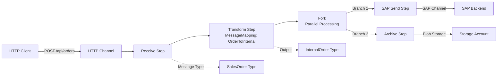

# SAP PI/PO — Source Design Analysis

> **Rules for analyzing SAP PI/PO architecture and generating architecture visualizations.**

## Analysis Strategy

### Step 1: Artifact Inventory

Build complete inventory of:
- Integration Processes (root orchestration objects)
- Message Mappings (data transformations)
- Message Types (schema definitions)
- Communication Channels (protocol bindings)
- Sender/Receiver Agreements (runtime bindings)
- Adapters (protocol handlers)

### Step 2: Dependency Graph

Create dependency graph:
- Integration Process → Message Mappings (transform steps)
- Integration Process → Message Types (input/output)
- Integration Process → Communication Channels (via agreements)
- Mappings → Message Types (source/target)

### Step 3: Pattern Detection

Identify integration patterns:
- **Request-Reply:** Synchronous process
- **Async Publish-Subscribe:** Fork/Join with multiple receivers
- **Batch Processing:** Loop steps with aggregation
- **Error Handling:** Exception handling blocks
- **Routing:** Switch/decision steps

### Step 4: Complexity Assessment

Rate each artifact:
- **Simple:** Direct mapping, single protocol, no branching
- **Medium:** Multi-step, 2-3 protocols, one decision
- **Complex:** Loops, nested decisions, multiple mappings, error handlers

## Visualization Rules

### Architecture Diagram Structure

Generate Mermaid diagram showing:

1. **Sender Components** (left side) — Message sources
2. **Integration Process** (center) — Main orchestration logic
3. **Processing Steps** (center detail) — Process flow with steps
4. **Receiver Components** (right side) — Message destinations
5. **Mappings** (connectors) — Data transformation

### Visualization Example

For the OrderProcessing integration process:



## Pattern Detection Output

### Request-Reply Pattern

**Detection Criteria:**
- Single Receive step
- Single Send/Request-Reply step
- No fork/join

**Example Output:**
```json
{
  "patternType": "request-reply",
  "confidence": 0.95,
  "description": "Synchronous order processing",
  "steps": ["receive", "transform", "send"],
  "protocols": ["HTTP", "SAP"],
  "migrationStrategy": "Direct Logic Apps workflow"
}
```

### Pub-Sub Pattern

**Detection Criteria:**
- Single Receive step
- Fork with multiple Send steps
- Possible Join for aggregation

**Example Output:**
```json
{
  "patternType": "publish-subscribe",
  "confidence": 0.87,
  "description": "Event distributed to multiple systems",
  "steps": ["receive", "fork", "send", "send", "join"],
  "protocols": ["HTTP", "JMS", "SFTP"],
  "migrationStrategy": "Parallel Logic Apps with Service Bus topic"
}
```

### Batch Processing Pattern

**Detection Criteria:**
- Loop step processing collections
- Aggregation of results
- Possible error handling

**Example Output:**
```json
{
  "patternType": "batch-processing",
  "confidence": 0.92,
  "description": "Process batch of invoices",
  "steps": ["receive", "loop", "transform", "aggregate", "send"],
  "protocols": ["File", "Database", "SFTP"],
  "migrationStrategy": "Logic Apps with For-Each and Aggregation"
}
```

## Complexity Scoring

### Scoring Factors

| Factor | Points |
|---|---|
| Per integration process | 10 base |
| Per transformation step | +5 |
| Conditional logic (switch) | +10 |
| Loop/iteration | +15 |
| Fork/parallel processing | +20 |
| Error handling block | +10 |
| Nested subprocess call | +15 |
| Custom adapter | +25 |

### Complexity Levels

- **Low (10-30 points):** Direct mapping, simple flow
- **Medium (31-60 points):** Multi-step with some branching
- **High (61-100 points):** Complex orchestration
- **Very High (100+ points):** Highly intricate with many interactions

## Architecture Summary Report

Generate summary report with:

```markdown
# SAP PI/PO Architecture Analysis

## Overview
- Total Integration Processes: 5
- Total Message Mappings: 8
- Total Communication Channels: 12
- Adapter Types: HTTP, JDBC, SFTP, SAP

## Patterns Detected
- Request-Reply: 2 processes
- Pub-Sub: 1 process
- Batch Processing: 1 process
- Error Handling: 3 processes

## Complexity Distribution
- Low: 1 process
- Medium: 2 processes
- High: 2 processes

## Estimated Effort
- Low-complexity migration: 5 processes × 3 days = 15 days
- Testing and validation: 10 days
- **Total: ~25 days**

## Key Considerations
- Adapter coverage: 90% of adapters have Logic Apps equivalents
- Mapping complexity: 75% can be expressed in Liquid
- Custom code detected: 2 custom mappings require Azure Functions
```

## Analysis Rules Engine

Apply these rules systematically:

1. **For each IntegrationProcess:**
   - Analyze all referenced artifacts
   - Determine pattern type
   - Score complexity
   - Identify gaps and risks

2. **For each MessageMapping:**
   - Check mapping rules count
   - Identify functions used
   - Assess Liquid template feasibility
   - Flag custom code

3. **For each CommunicationChannel:**
   - Identify adapter type
   - Check for Logic Apps connector equivalent
   - Note configuration parameters
   - Flag gaps

4. **For each Adapter:**
   - Lookup Logic Apps equivalent
   - Check connector features
   - Note protocol requirements
   - Flag unsupported features

## Risk Assessment

Identify risks and flag for detailed analysis:

| Risk | Flag | Mitigation |
|---|---|---|
| Custom adapter | ⚠️ | Build custom connector |
| High complexity | ⚠️ | Break into smaller workflows |
| Unsupported function | 🔴 | Implement in Azure Function |
| Legacy protocol | 🔴 | Protocol translation layer |
| Large message volume | ⚠️ | Implement batching strategy |

## Deliverables

This analysis produces:

1. **Architecture Diagram (Mermaid):** Visual representation
2. **Pattern Report:** Detected patterns with confidence scores
3. **Complexity Assessment:** Per-process complexity scores
4. **Gap Analysis:** Unsupported features identified
5. **Effort Estimation:** Time and resource estimates
6. **Risk Register:** Identified risks and mitigations
